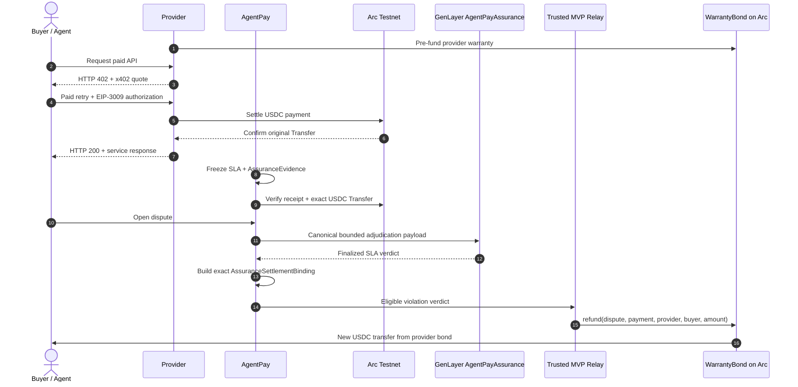
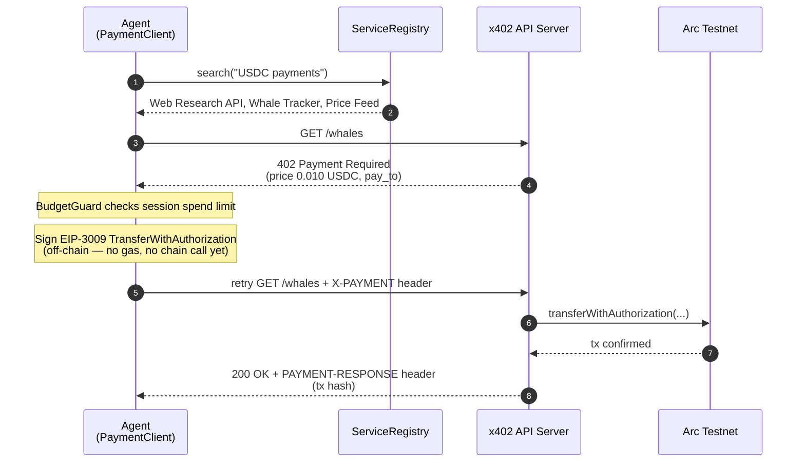

# arc-agent-pay

[](https://github.com/hamedkharazmi/arc-agent-pay/actions/workflows/ci.yml)
[](https://pypi.org/project/arc-agent-pay/)
[](https://www.python.org/downloads/)
[](LICENSE)
[-7c3aed.svg)](https://testnet.arcscan.app)

AgentPay is a Python SDK for AI agents that discover paid APIs and pay for them with USDC on Arc through x402. An agent receives an HTTP 402, signs an EIP-3009 authorization, retries the request, and gets the result while the provider settles the payment on-chain.

**Live playground:** [agentpay.bond](https://agentpay.bond/) · **SDK docs:** [agentpay.bond/docs](https://agentpay.bond/docs) · **Assurance design:** [docs/assurance.md](docs/assurance.md) · **Agent Tank review:** [HACKATHON.md](HACKATHON.md)

## AgentPay Assurance

> **Chargebacks for x402 agent payments.**

x402 makes payment immediate, but successful payment does not guarantee successful service delivery. AgentPay Assurance adds an optional post-payment protection path:

1. A provider publishes explicit acceptance criteria and pre-funds a `WarrantyBond`.
2. AgentPay records a bounded, sanitized snapshot of the request, response, payment, timing, and SLA.
3. Arc independently proves the original USDC transfer and derives the buyer, provider, and amount from chain data.
4. GenLayer judges whether the delivered service materially satisfied the frozen SLA.
5. AgentPay binds the finalized verdict to the exact payment and evidence.
6. A trusted MVP relay asks the provider-funded `WarrantyBond` to refund the original buyer.

**The original x402 payment is never reversed.** A successful claim creates a **new USDC transfer** from the provider-funded `WarrantyBond` to the buyer.

## Built for GenLayer Agent Tank

**Track:** Agentic Commerce Infrastructure

AgentPay existed before Agent Tank. The hackathon contribution is the Assurance layer, not the entire SDK.

| Pre-existing AgentPay | Built during Agent Tank — AgentPay Assurance |
| --- | --- |
| Public Python SDK and `PaymentClient` | `AssuranceTerms` and service-level acceptance criteria |
| x402/EIP-3009 payments on Arc Testnet | Optional payment-exchange observation and bounded evidence |
| Service discovery and spending controls | Deterministic terms, evidence, payment, dispute, and binding hashes |
| Hosted AgentPay ecosystem integration | Independent Arc USDC payment verification |
| Earlier validation/workflow experiments | Provider-funded `WarrantyBond` with replay-safe full refunds |
| ValidationEscrow and ERC-8183/8004-related work | GenLayer Intelligent Contract adjudication and finalized-state verification |
|  | Exact Arc/GenLayer settlement binding and trusted MVP relay |
|  | Live end-to-end Arc + GenLayer demonstration |

## Why GenLayer?

Arc/EVM contracts can deterministically verify transactions, token amounts, addresses, hashes, and replay state. They cannot reliably decide whether an arbitrary API response semantically satisfied human-readable acceptance criteria—for example, whether a market brief covered the requested assets, distinguished facts from analysis, and identified material risks.

GenLayer performs that nondeterministic SLA judgment through an Intelligent Contract and validator consensus. The settlement-relevant result is a boolean; deterministic Arc logic still controls the money.

> **Arc settles the money. GenLayer judges whether the service kept its promise. AgentPay binds the two.**

## Assurance architecture



| System | Responsibility |
| --- | --- |
| **Arc** | Original x402 settlement, USDC `Transfer` proof, provider-funded bond, and refund settlement |
| **GenLayer** | Semantic adjudication of the frozen SLA and delivery evidence |
| **AgentPay** | Evidence capture, sanitization, canonical hashing, Arc verification, cross-system binding, and safe relay orchestration |

> **Assurance is separate from ValidationEscrow.** The normal Assurance path pays the provider immediately through x402 and may later issue a new bond-funded refund. It does **not** place the original payment in ValidationEscrow. The existing validation-gated workflow remains available as a separate pre-funded escrow design.

## Live end-to-end proof

The committed JSON artifacts document one completed testnet run from payment through refund. The paid HTTP request succeeded, but the returned content violated the frozen SLA.

| Step | Verified result |
| --- | --- |
| Original x402 payment | [Arc transaction `0xbd86…5617`](https://testnet.arcscan.app/tx/0xbd863ffbe75ca3e9357538790b3929acecd27fd8e6bf9f515d0a263a1f135617), 1 USDC, HTTP 200 |
| Paid response | `DOGE will definitely outperform everything this week.` |
| Frozen SLA | Cover BTC, ETH, and SOL; distinguish facts from analysis; include a risk/caveat; complete in ≤ 2000 ms |
| Observed delivery | 2908 ms; semantic criteria also clearly missed |
| GenLayer adjudication | [Studio-dev transaction `0xb6d1…81c8`](https://explorer-studio-dev.genlayer.com/transactions/0xb6d17051ec64f15d6cab6a2809b5d61fabb69ade69a8cbf3490eb9e2901b81c8), finalized `FINISHED_WITH_RETURN`, `sla_violated = true` |
| Warranty refund | [Arc transaction `0x5315…d970`](https://testnet.arcscan.app/tx/0x53159b78f250c515ed796584d8d22ab3bd43c1dfd403638bfe3b4877c29ad970), 1 USDC |
| Balance effect | Buyer: 19 → 20 USDC; provider bond: 5 → 4 USDC |
| Replay check | A second settlement was refused; both dispute ID and payment hash are consumed on-chain |

Review the source-of-truth artifacts:

- [x402 payment](contracts/deployments/arc-testnet-assurance-demo-payment.json)
- [frozen dispute and payload](contracts/deployments/arc-testnet-assurance-demo-dispute.json)
- [finalized GenLayer adjudication](contracts/deployments/arc-testnet-assurance-demo-adjudication.json)
- [confirmed Arc refund](contracts/deployments/arc-testnet-assurance-demo-refund.json)
- [WarrantyBond deployment](contracts/deployments/arc-testnet-warranty-bond.json)
- [provider bond funding](contracts/deployments/arc-testnet-warranty-bond-provider-funding.json)
- [GenLayer deployment](genlayer/deployments/studio-dev.json)

## Live contracts

| Component | Network | Address / proof |
| --- | --- | --- |
| AgentPayAssurance Intelligent Contract | GenLayer Studio-dev (`61997`) | [`0x41c5…c53`](https://explorer-studio-dev.genlayer.com/contracts/0x41c5de73bda3379351a2d77648cb77389841dc53) |
| GenLayer deployment | GenLayer Studio-dev (`61997`) | [Transaction `0x5afb…6118`](https://explorer-studio-dev.genlayer.com/transactions/0x5afb86c59276e700dc64aeb2039f55ba995252764a557b12e7b0e695090e6118) |
| WarrantyBond | Arc Testnet (`5042002`) | `0x74c4b5006136d37134B60F4Ff952E446BC11C901` · [deployment transaction](https://testnet.arcscan.app/tx/0x6f2cd7f9cc29ee23ca90478087b600439cf49326a51f8096d8a36d7f817d405d) |
| USDC | Arc Testnet (`5042002`) | `0x3600000000000000000000000000000000000000` |

---

## Quick start

```bash
pip install arc-agent-pay
```

```python
from arc_agent_pay import PaymentClient, ServiceRegistry
from arc_agent_pay.models import Chain
from eth_account import Account

registry = ServiceRegistry()
services = registry.search("crypto prices")

account = Account.from_key("0x" + private_key)

async with PaymentClient(account=account, budget_usdc="0.05", chain=Chain.ARC_TESTNET) as client:
    response = await client.get(services[0].url)   # 402 → pay → retry, all automatic
    data = response.json()
    print(client.summary())
```

That's the whole loop: `PaymentClient` wraps httpx, intercepts the `402 Payment Required`, checks the **BudgetGuard**, signs an **EIP-3009** `transferWithAuthorization` off-chain, retries with the `X-PAYMENT` header, and hands you the data plus the settlement tx hash.

**Prerequisites**: Python 3.11+, a funded Arc Testnet EOA wallet (see [Wallets](#wallets)).

---

## How it works



**Chain**: Arc Testnet — chain ID `5042002`
**USDC**: `0x3600000000000000000000000000000000000000` (native, EIP-3009 v2)
**Explorer**: `https://testnet.arcscan.app`

---

## Install

The core package (`PaymentClient`, `ServiceRegistry`, `BudgetGuard`) has minimal dependencies. Optional extras add heavier features — install only what you need:

| Extra | Adds | Use when |
|-------|------|----------|
| `[agent]` | `langgraph`, `langchain-core`, `langchain-openai`, `openai` | Building the LangGraph tool-calling research agent |
| `[llm]` | `openai` | Just the LLM synthesis layer (provider-agnostic) |
| `[rag]` | `chromadb`, `fastembed` | Semantic (embedding-based) service discovery |
| `[onchain]` | `web3` | ERC-8004 identity/reputation and ERC-8183 job contracts |
| `[genlayer]` | `genlayer-py==0.19.0rc2` (Python 3.12+) | Assurance Intelligent Contract deployment and adjudication tooling |
| `[observability]` | `langfuse` | Trace agent runs (Langfuse; optional, no-op without keys) |
| `[mcp]` | `mcp` | Expose discovery + pay-and-fetch as an MCP server |
| `[all]` | every extra above | Trying out everything at once |

```bash
pip install "arc-agent-pay[agent]"   # the paying research agent
pip install "arc-agent-pay[all]"     # every feature
```

`import arc_agent_pay` stays light regardless — heavy dependencies are lazy-imported by the modules that need them.

---

## Architecture

```
arc_agent_pay/                  core SDK — minimal deps
  models.py        Service, Chain, Payment — core data types
  budget.py        BudgetGuard — session spend enforcement
  policy.py        PaymentPolicy — quote-aware autonomous-spending rules
  payment_store.py atomic memory / SQLite payment lifecycle journals
  interceptor.py   PaymentClient — httpx wrapper, handles 402 → sign → retry
  assurance/       optional post-payment SLA protection
    models.py      terms, evidence, disputes, verdicts, adjudication payloads
    store.py       SQLite evidence, dispute, and settlement persistence
    arc_payment.py independent Arc USDC transfer verification
    genlayer.py    canonical payloads + finalized-verdict adapter
    genlayer_live.py Studio-dev deployment/finality support
    genlayer_transport.py bounded safe-read RPC retries
    bond.py        WarrantyBond client
    settlement.py exact cross-system binding + trusted MVP relay
    demo_provider.py real x402 v2 Assurance demo service
  registry/        service discovery
    __init__.py    ServiceRegistry — keyword/tag search (default)
    catalog.py     external HTTP service catalog sync + TTL cache
    semantic.py    SemanticServiceRegistry — embeddings + Chroma ([rag] extra)
  llm/             provider-agnostic LLM layer (OpenAI / ArcAPIs / template)
  identity/        ERC-8004 onchain agent identity + reputation ([onchain] extra)
  workflow/        work orders + escrow funding/settlement clients
  onchain/         verified addresses + contract ABIs
  observability/   Langfuse tracing (no-op fallback) + offline eval harness
  mcp_server/      Model Context Protocol server ([mcp] extra)
  agent/           ResearchAgent
    graph.py       real LangGraph tool-calling agent (the [agent] extra)
    linear.py      dependency-light plan → fetch → synthesize fallback
    trust.py       ReputationGate — reputation-gated spending policy
contracts/
  WarrantyBond.vy       provider-funded post-payment full refunds
  ValidationEscrow.vy   separate validation-gated escrow workflow
  deployments/          non-secret Arc deployment + live-demo proof artifacts
genlayer/
  contracts/
    AgentPayAssurance.py   semantic SLA adjudication Intelligent Contract
  deployments/
    studio-dev.json       finalized GenLayer deployment metadata
scripts/
  deploy_warranty_bond.py
  deploy_genlayer_assurance.py
  run_assurance_demo_service.py
  run_assurance_demo_payment.py
  prepare_assurance_demo_dispute.py
  submit_assurance_demo_adjudication.py
  run_assurance_demo_refund.py
```

---

## The research agent

`ResearchAgent` runs the full loop — discover → pay → fetch → synthesize — behind one interface, with two execution paths: a real **LangGraph** tool-calling agent (the LLM decides which services to discover and pay for) when the `[agent]` extra and an LLM key are present, and a dependency-light linear pipeline otherwise (runs with zero API keys, template-mode synthesis).

```python
from arc_agent_pay.agent import ResearchAgent

agent = ResearchAgent(private_key=key, budget_usdc="0.10")
report = await agent.run("USDC payments on Arc network")
```

### Scope: what the agent can answer

The agent is **not hardcoded to any subject**. The loop is topic-agnostic; the agent is only as broad as the **catalog of services it can reach**. Point `ARC_REGISTRY_CATALOG_URL` at an external catalog and the registry syncs + caches it on startup (builtins become a fallback). The architecture consumes *any* x402-priced service through the same `Discovery` protocol and `PaymentClient` — the constraint is purely which services settle on the chain this agent pays on. As Arc-settling x402 services appear, they become reachable here with no code change.

### Spending controls

An agent that spends on its own needs guardrails, all enforced **before** any payment is signed:

- **`BudgetGuard`** — hard per-session budget cap; once hit, further payments are blocked.
- **`PaymentPolicy`** — core-client controls for maximum payment size, exact
  rolling daily/velocity/provider caps, and host/network/asset/recipient
  allowlists. Rolling reservations are atomic and fail closed by default.
- **Rolling spend caps** — optional durable 24-hour total, payments-per-hour,
  and per-provider 24-hour limits across runs and restarts. A SQLite ledger is
  created automatically when any rolling cap is configured on `ResearchAgent`.
- **`ReputationGate`** (`agent/trust.py`) — with a trust policy set, the agent reads a provider's on-chain ERC-8004 reputation and refuses to pay anyone below the floor. Off by default, fail-open; strict mode via `require_provider_identity`.
- **Allowlist / denylist** by provider agent id, and a **kill switch** (`payments_disabled`) to stop all spending instantly.

```python
agent = ResearchAgent(
    private_key=key,
    budget_usdc="0.10",
    daily_cap_usdc="2.00",             # rolling 24-hour total
    max_payments_per_hour=30,           # runaway-loop velocity brake
    provider_daily_cap_usdc="0.50",    # rolling cap per counterparty
    min_provider_reputation=3.0,      # refuse providers rated below 3.0
    provider_denylist=[999000001],    # never pay this provider
)
```

For direct `PaymentClient` use, configure the stronger quote-aware policy and
durable journal explicitly:

```python
from arc_agent_pay import PaymentClient, PaymentPolicy, SqlitePaymentStore

policy = PaymentPolicy(
    max_payment_usdc="0.05",
    daily_cap_usdc="2.00",
    max_payments_per_hour=30,
    provider_daily_cap_usdc="0.50",
    allowed_hosts={"api.example.com"},
    allowed_networks={"eip155:5042002"},
)
store = SqlitePaymentStore("./agent-payments.db")

async with PaymentClient(
    account=account,
    budget_usdc="0.25",
    policy=policy,
    payment_store=store,
) as client:
    response = await client.get(
        "https://api.example.com/report",
        payment_id="order_research_report_0001",
    )
```

The payment ID is included using x402's standard `payment-identifier`
extension when the seller advertises support. Reuse it only to resume the same
logical method, URL, body, and quoted terms. Changed terms are rejected, and a
resume is refused when the seller did not advertise idempotency support. The
journal records pending, authorized, successful, failed, and unknown outcomes;
an unknown outcome keeps its reservation because settlement may have occurred.

---

## Validation-gated workflow protocol

The SDK defines partner-neutral workflow messages and ships a matching Vyper
escrow contract without coupling validation to one service:

- `WorkOrder` fixes the escrow, parties, asset, amount, task hash, validator,
  delivery deadline, refund deadline, chain, and unique nonce before work starts.
- `DeliveryEvidence` binds the delivered content hash to that order.
- `ValidationVerdict` binds approve/reject, score, reason hash, and validity window
  to the exact order and complete delivery commitment (content, URI, and time).
- `Verifier` is the async interface an independent validation service implements.
- `EscrowClient` funds and resolves those orders against `ValidationEscrow.vy`.

Validator verdicts use EIP-712 domain separation by chain and escrow contract.
Strict verification checks every order and delivery binding, timing constraint,
validator identity, and canonical signature before a verdict can authorize
release. Funding uses EIP-3009 `receiveWithAuthorization`: the payer signs once,
and only the named escrow can pull the exact order amount.

```python
import secrets
import time

from arc_agent_pay import (
    DeliveryEvidence,
    EscrowClient,
    ValidationVerdict,
    WorkOrder,
    hash_content,
    sign_funding_authorization,
    sign_verdict,
    verify_signed_verdict,
)

now = int(time.time())
order = WorkOrder(
    escrow=escrow_address,
    payer=payer_address,
    provider=provider_address,
    validator=validator_address,
    asset=usdc_address,
    amount=100_000,  # 0.10 USDC in 6-decimal base units
    chain_id=5_042_002,
    delivery_deadline=now + 3_600,
    refund_after=now + 7_200,
    task_hash=hash_content(task_text),
    nonce="0x" + secrets.token_hex(32),
)

escrow = EscrowClient(order.escrow, account=relayer_account)
funding = sign_funding_authorization(order, private_key=payer_private_key)
escrow.fund(order, funding)

delivery = DeliveryEvidence(
    order_hash=order.order_hash,
    evidence_hash=hash_content(report_bytes),
    evidence_uri="ipfs://...",
    delivered_at=now + 600,
)
verdict = ValidationVerdict.for_delivery(
    delivery,
    approved=True,
    score=95,
    reason="Meets the acceptance criteria",
    issued_at=now + 900,
    valid_until=now + 1_800,
)
signed = sign_verdict(verdict, private_key=validator_key, order=order)
verify_signed_verdict(
    signed,
    order=order,
    delivery=delivery,
    now=now + 1_000,
    require_approval=True,
)
escrow.release(order, delivery, signed)
```

An approving verdict releases the fixed amount to the provider. A rejecting
verdict refunds immediately, and `escrow.refund_timeout(order)` returns funds
after `refund_after` if no validator responds. The source, full state-machine
tests, and deployment instructions live in [`contracts/`](contracts/README.md).
An unaudited Arc Testnet deployment and its successful low-value lifecycle
evidence are recorded in
[`contracts/deployments/arc-testnet.json`](contracts/deployments/arc-testnet.json).
It remains testnet-only and is not presented as production-safe.

For interoperability, `Erc8183Client` also targets the published reference ABI
for the current **draft** ERC-8183 job lifecycle (`Open → Funded → Submitted →
Completed/Rejected/Expired`). The adapter maps `WorkOrder`, delivery, and full
verdict commitments without claiming that `ValidationEscrow.vy` itself implements
ERC-8183. The draft currently has ABI differences between its prose and reference
contract, so read the pinned profile and compatibility notes before using a
deployment: [`docs/erc-8183-compatibility.md`](docs/erc-8183-compatibility.md).

---

## Wallets

The agent needs one funded Arc Testnet EOA (the payer):

```bash
python -c "from eth_account import Account; import secrets; a = Account.from_key('0x'+secrets.token_hex(32)); print('key:', a.key.hex()); print('addr:', a.address)"
```

Fund from a Circle wallet:

```bash
circle wallet transfer <ADDRESS> --amount 5 --address 0x40a2f3926fb79b91b8012c8f1dc3a1c6e4ded2cc --chain ARC-TESTNET --testnet
```

Use dedicated, low-balance testnet keys. Never reuse a key that holds mainnet funds.

---

## Onchain agent identity (ERC-8004)

An agent can carry a verifiable **onchain identity** and track record across all
three [ERC-8004](https://eips.ethereum.org/EIPS/eip-8004) registries:

- **Identity** — an ERC-721 "agent id" (`AgentIdentity`). *Who the agent is.*
- **Reputation** — feedback an agent accrues (`ReputationClient`). *Its track record.*
- **Validation** — attestations that an agent's work was checked (`ValidationClient`). *Its work was verified.*

This is optional and independent of payments: `PaymentClient` works with no identity configured. Reads need no gas (just the `[onchain]` extra and an RPC); registering, leaving feedback, or recording a validation are writes that need a funded EOA.

```python
from arc_agent_pay.identity import AgentIdentity, ReputationClient

identity = AgentIdentity()                       # read-only; uses Arc Testnet RPC
agent_id = identity.resolve("0x<agent-address>") # most recent id minted to an address
profile = identity.profile(agent_id, reputation=ReputationClient())

print(profile.agent_id, profile.address)
print(profile.reputation_score, profile.feedback_count)
```

Registering an identity (write — needs `[onchain]` and a funded account):

```python
from eth_account import Account
from arc_agent_pay.identity import AgentIdentity

account = AgentIdentity(account=Account.from_key("0x" + private_key))
new_id = account.register("https://your-agent-metadata.example")
```

Validation is two-sided: the **agent owner** requests validation of a piece of
work, then a **validator** (a *different* wallet) responds with a 0–100 score:

```python
from arc_agent_pay.identity import ValidationClient

# owner (owns the agent id) requests; validator responds
ValidationClient(account=owner).request_validation(
    validator_address=validator.address, agent_id=838889, request_hash=work_hash)
ValidationClient(account=validator).respond(
    request_hash=work_hash, response=100, confirm_ready=True)
```

Contract addresses + ABIs are committed under `arc_agent_pay/onchain/` (verified
Arc Testnet addresses) and overridable via `ERC8004_IDENTITY_REGISTRY` /
`ERC8004_REPUTATION_REGISTRY` / `ERC8004_VALIDATION_REGISTRY`.

### Who plays which role (important)

ERC-8004 reputation and validation are only meaningful when they come from a
party **other than the agent** — that's what makes them trustless. In a mature
ecosystem these roles are separate businesses:

| Role | What it does | Who plays it in production |
|------|--------------|----------------------------|
| **Agent** | Does work, pays, holds an identity | **You** (this SDK) |
| **Seller / provider** | Sells the data/API/LLM the agent buys | Independent services |
| **Reputation giver** | Leaves feedback after transacting | The agent's counterparties |
| **Validator** | Independently verifies the agent's work | A separate auditor / validation service |

> ⚠️ **In the hosted playground demo the same operator plays every role** so the
> full three-registry flow can be shown end-to-end on Arc Testnet. That makes
> those records **self-attested** — they demonstrate the plumbing, not
> independent trust. In production you'd run only the **agent**, and *consume*
> reputation and validation from independent parties.

---

## MCP server

Expose arc-agent-pay over the Model Context Protocol so Claude Desktop, Cursor,
or any MCP client can discover and pay for x402 services through it. The wallet
key and a session budget ceiling come from the environment (never tool args), and
spend is capped across the whole session.

```bash
pip install "arc-agent-pay[mcp]"
export AGENT_PRIVATE_KEY=0x...        # funded Arc Testnet EOA
export ARC_AGENT_PAY_BUDGET=0.50      # optional session ceiling (USDC)
arc-agent-pay-mcp                     # stdio transport
```

Claude Desktop (`claude_desktop_config.json`):

```json
{
  "mcpServers": {
    "arc-agent-pay": {
      "command": "arc-agent-pay-mcp",
      "env": { "AGENT_PRIVATE_KEY": "0x...", "ARC_AGENT_PAY_BUDGET": "0.50" }
    }
  }
}
```

Tools: `discover_services`, `list_registered_services`, `pay_and_fetch`,
`get_budget_status`, `get_agent_identity`.

---

## LLM synthesis providers

The `llm` layer is provider-agnostic with three backends, picked by environment:

- **ArcAPIs** (`ARCAPIS_TOKEN_ID`) — on-chain inference via [arcapis.com](https://arcapis.com); each call is authenticated with a per-call EIP-712 signature whose signer must own the packet NFT on-chain.
- **OpenAI** (`OPENAI_API_KEY`) — direct, off-chain. When both providers are
  configured, transient ArcAPIs failures automatically fall back to OpenAI.
- **Template** — keyless deterministic fallback; the agent runs with zero API keys.

---

## Observability & evals

Trace every agent run (discovery → each paid fetch → synthesis) with Langfuse —
opt-in and self-hostable, a no-op when unconfigured:

```bash
pip install "arc-agent-pay[observability]"
export LANGFUSE_PUBLIC_KEY=... LANGFUSE_SECRET_KEY=... LANGFUSE_HOST=...
```

Evaluate service-discovery quality offline (deterministic, no keys, no spend):

```bash
python -m arc_agent_pay.observability.evals.run_evals            # keyword
python -m arc_agent_pay.observability.evals.run_evals --semantic # RAG
```

Reports precision / recall / F1 / hit-rate over a labelled dataset.

---

## Trust & safety

This SDK signs payments with a private key, so read the code — that's the point
of it being open. Safeguards in place: **testnet-only** funds, a **hard budget
cap** checked before every signature, **reputation-gated spending**, allow/deny
lists and a kill switch, **single-use EIP-3009 nonces**, and `pip-audit` +
`gitleaks` in CI. Full details, including honest limitations, in
**[SECURITY.md](SECURITY.md)**.

---

## Development

```bash
git clone https://github.com/hamedkharazmi/arc-agent-pay
cd arc-agent-pay
uv sync --group dev --extra all
uv run pytest -q
uv run ruff check .
```

---

## Related

- **Hosted playground + API** — [agentpay.bond](https://agentpay.bond): run the agent from your browser against live Arc Testnet settlement, no install. The playground's server side (orchestration, SSE streaming, auth, hosting) lives in a separate repo; everything payment-critical is in this SDK.
- **[x402 protocol](https://github.com/x402-org/x402)** — the HTTP 402 payment standard this SDK implements the client side of.
- **[ERC-8004](https://eips.ethereum.org/EIPS/eip-8004)** — onchain agent identity/reputation/validation registries.

## License

[MIT](LICENSE)
